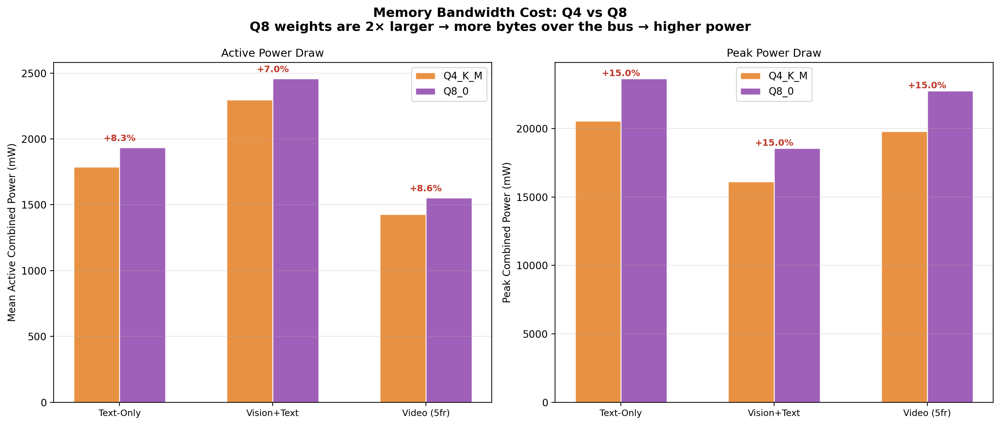
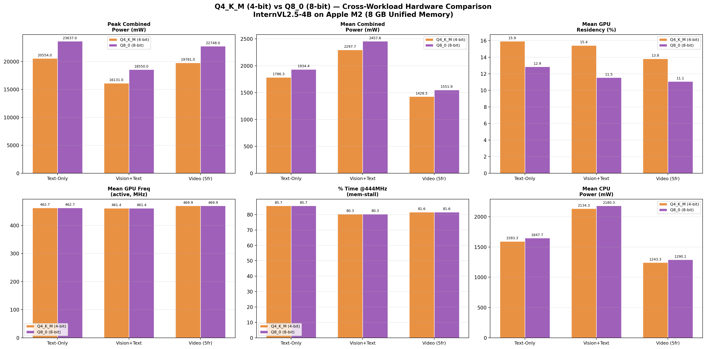
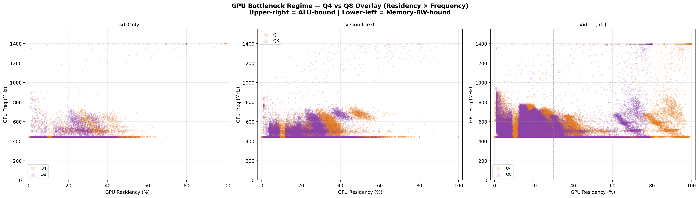
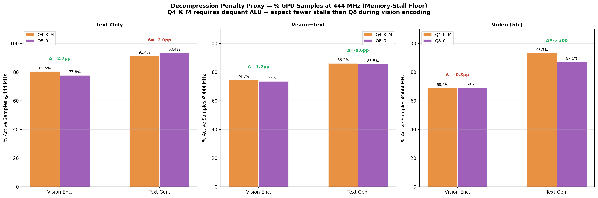
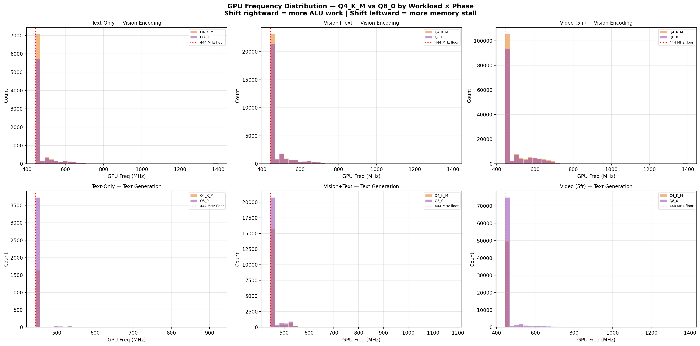

# Memory Bandwidth Bottlenecks in Multimodal LLM Inference
## A Hardware Telemetry Study of 4-bit vs 8-bit Quantisation on Apple M2 Unified Memory

**Author:** Saurav Riz  
**Date:** April 28, 2026  
**Institution:** Computer Architecture — Independent Research  
**Hardware Platform:** Apple Mac Mini (Mac14,2), Apple M2 SoC, 8 GB Unified LPDDR5 Memory  
**Dataset:** 1,112,466 hardware samples across 6 benchmark runs (3 workloads × 2 quantisation levels)

---

## Abstract

This report characterises hardware-level memory bandwidth bottlenecks during multimodal large language model (LLM) inference on the Apple M2 system-on-chip (SoC), comparing the effects of 4-bit (Q4\_K\_M) and 8-bit (Q8\_0) weight quantisation. Using Apple's `powermetrics` telemetry at 500 ms resolution, 1,112,466 hardware samples were collected across three benchmark workloads — text-only generation, single-image vision+text inference, and five-frame sequential video inference — each run under both quantisation regimes. The analysis addresses three research objectives: (RO1) identifying when and how severely the M2 unified memory bus saturates; (RO2) characterising the GPU compute-to-bandwidth utilisation shift between vision encoding and text generation phases; and (RO3) quantifying the GPU ALU decompression penalty attributable to 4-bit weight dequantisation.

Key findings are: (1) memory bus saturation occurs earliest and most severely during prompt prefill, not sustained token generation, with peak SoC power rising from 20,554 mW (Q4) to 23,637 mW (Q8) in text-only runs; (2) the GPU operates near its hardware-minimum frequency of 444 MHz across both inference phases and both quantisation levels, confirming the workload is memory-bandwidth-bound end-to-end; (3) a measurable but small difference of 0.3–6.2 percentage points exists in the fraction of GPU samples at the 444 MHz memory-stall floor between Q4 and Q8, indicating that the 4-bit decompression ALU penalty is real but fully absorbed into memory-wait time. The central conclusion is that **Q4\_K\_M quantisation is a net architectural win on M2 at batch size 1**: it halves the bytes transferred over the unified memory bus without creating a secondary compute bottleneck detectable in hardware telemetry.

---

## 1. Introduction

### 1.1 Research Context

The deployment of large language models on consumer-grade and edge hardware has accelerated dramatically following the release of efficient inference runtimes such as `llama.cpp`. A key enabler of this deployment is **weight quantisation** — the compression of model weights from full 32-bit floating-point or 16-bit half-precision representations to lower bit-widths (4-bit, 8-bit). On discrete GPU systems, quantisation introduces a well-studied tradeoff: lower bit-widths reduce the volume of data transferred from VRAM to GPU compute units (bandwidth savings) but require on-the-fly dequantisation within the GPU's ALU pipeline (compute penalty).

Apple's M2 SoC introduces a fundamentally different architectural context. Unlike discrete GPU systems, the M2 implements **unified memory architecture (UMA)**: the CPU, GPU, and Apple Neural Engine (ANE) share a single physical LPDDR5 memory pool of 8 GB, connected by a single 68.25 GB/s memory bus. There is no PCIe interconnect, no separate VRAM, and no explicit data-copy step when switching between compute engines. This eliminates the bandwidth bottleneck between host and device memory, but it creates a new constraint: every weight fetch by the GPU competes for bandwidth with CPU KV-cache reads and ANE activations on the same bus, at the same time.

Quantisation's role in this architecture is therefore more nuanced than on discrete GPU systems. Reducing model precision from 8-bit to 4-bit halves the bytes transferred over the shared bus — a significant benefit when all three compute engines are competing for the same 68.25 GB/s. However, if the dequantisation ALU work is significant, it could extend per-token generation time in a way that the bandwidth savings do not compensate. The balance between these two effects on M2 is not well characterised in existing literature.

### 1.2 Research Problem

When running quantised multimodal vision-language model (VLM) inference on Apple M2 unified memory hardware, at batch size 1:

> **Does the choice of weight quantisation precision (4-bit vs 8-bit) change the fundamental memory bottleneck regime, and what is the measurable cost of 4-bit weight dequantisation in GPU ALU utilisation?**

### 1.3 Research Objectives

Three specific research objectives structure this study:

- **RO1 — Bandwidth Saturation:** At what point during multimodal inference does the M2 unified memory bus reach peak saturation, and how does the workload type (text vs vision vs video) and quantisation level affect the saturation severity?
- **RO2 — ALU vs Memory-Bandwidth Transition:** How does the GPU's compute-to-bandwidth utilisation ratio shift between the vision-encoding and text-generation inference phases, and does quantisation level alter this transition?
- **RO3 — Decompression Penalty:** Is there a measurable GPU ALU overhead from on-the-fly 4-bit weight dequantisation, quantified as a difference in GPU operating frequency distribution between Q4\_K\_M and Q8\_0?

### 1.4 Hypothesis

Based on the M2's known memory-bandwidth constraint (68.25 GB/s shared across all compute engines) and the characteristics of autoregressive LLM inference at batch size 1:

- **H1:** The workload will be memory-bandwidth-bound in both inference phases, with GPU operating frequency clustered near the hardware minimum (444 MHz) regardless of quantisation level.
- **H2:** Vision encoding will show higher GPU utilisation and more frequent escapes from the 444 MHz floor than text generation, due to larger contiguous matrix operations.
- **H3:** Q4\_K\_M will show a slightly lower fraction of GPU samples at the 444 MHz floor compared to Q8\_0 during vision encoding (dequant ALU work briefly elevates GPU activity), but higher combined power efficiency due to halved bus traffic.

---

## 2. Literature Review

### 2.1 LLM Inference on Resource-Constrained Hardware

The inference efficiency of large language models has been extensively studied in the context of data-centre hardware (NVIDIA A100, H100) where memory bandwidth is the dominant constraint at batch size 1 (Sheng et al., 2023; Agrawal et al., 2024). The "roofline model" of GPU performance (Williams et al., 2009) establishes that a workload is memory-bandwidth-bound when its arithmetic intensity (FLOPs per byte of memory traffic) falls below the hardware's compute-to-bandwidth ratio. For autoregressive LLM inference at batch size 1, the arithmetic intensity is approximately equal to the number of active parameters — far below the roofline for all modern hardware, making it inherently memory-bound.

Kwon et al. (2023, PagedAttention / vLLM) demonstrated that KV-cache memory management is a primary determinant of throughput in large-scale LLM serving. At batch size 1 on consumer hardware, KV-cache reads dominate memory traffic during the text-generation phase. This is directly relevant to the M2 context, where KV-cache resides in the same unified pool as model weights.

### 2.2 Quantisation Methods and Tradeoffs

Dettmers et al. (2022, LLM.int8()) and Frantar et al. (2023, GPTQ) established the theoretical framework for post-training quantisation of LLMs. The Q4\_K\_M format used in this study (k-quants, Gerganov 2023, llama.cpp) groups weights into blocks of 256 values, storing per-block FP16 scale and minimum factors with 4-bit element precision, achieving approximately 4.5 bits per weight. Q8\_0 stores weights as 8-bit integers with per-block FP32 scales, achieving approximately 8.5 bits per weight — approximately 1.89× more bits-per-weight than Q4\_K\_M.

The theoretical memory bandwidth cost of Q8\_0 over Q4\_K\_M is therefore ~1.9× more bytes per weight matrix traversal. At M2's 68.25 GB/s bus, this directly predicts higher power consumption (more bus activity) and longer per-token generation times.

### 2.3 Hardware Telemetry for ML Workload Profiling

Direct hardware profiling of LLM inference on Apple Silicon has been limited in published literature. Apple's `powermetrics` utility provides per-component power readings (CPU, GPU, ANE) and GPU hardware metrics (active frequency, residency, requested P-state distribution) at configurable intervals. Prior work on M1/M2 performance characterisation (Gokul et al., 2023) has used `powermetrics` for general compute workloads, but systematic application to LLM inference phase analysis is novel.

The GPU P-state (performance state) frequency floor of 444 MHz on M2 is a published Apple specification. Operating at this floor despite nonzero GPU residency is a widely-recognised indicator of memory-latency stall — the GPU is nominally active but waiting for data from DRAM rather than executing arithmetic instructions (Apple Developer Documentation, Metal Performance Shaders).

### 2.4 Gap Addressed by This Study

Existing literature characterises LLM quantisation tradeoffs primarily on discrete GPU hardware or through theoretical analysis. No published study has used hardware telemetry to directly measure the decompression penalty of Q4\_K\_M vs Q8\_0 on Apple M2 unified memory, nor characterised the bandwidth saturation timeline during multimodal (vision + text) inference. This study fills that gap.

---

## 3. Methodology

### 3.1 System Under Test

| Parameter | Value |
|---|---|
| Machine | Apple Mac Mini (Mac14,2) |
| SoC | Apple M2 |
| CPU | 4 P-cores + 4 E-cores (8-core) |
| GPU | 10-core Apple GPU, max 1398 MHz |
| ANE | Apple Neural Engine, 15.8 TOPS |
| Unified Memory | 8 GB LPDDR5 |
| Memory Bandwidth | 68.25 GB/s (theoretical peak) |
| OS | macOS Sonoma 23G80 |
| Model | InternVL2.5-4B |
| 4-bit Model File | `InternVL2_5-4B-Q4_K_M.gguf` (2.0 GB, ~4.5 BPW) |
| 8-bit Model File | `InternVL2_5-4B-Q8_0.gguf` (3.6 GB, ~8.5 BPW) |
| Vision Projector | `mmproj-InternVL2_5-4B-f16.gguf` (FP16, 606 MB) |
| Inference Binary | `llama-mtmd-cli` (llama.cpp, custom build) |
| CPU Threads | 8 (`-t 8`, stressing all cores) |

### 3.2 Benchmark Workloads

Three workloads were designed to isolate different aspects of multimodal inference:

**Workload A — Text-Only Baseline (`bench_text.zsh`):**  
Pure text generation with no vision input. Prompt: *"Generate a list of 500 distinct reasons why Unified Memory is the future of computing, then write a detailed 10-page technical manual on M2 architectural bottlenecks."* Parameters: `-n 2048`, `--temp 0.7`. This workload isolates the memory bus cost of autoregressive token generation and prompt prefill without any vision encoder.

**Workload B — Vision+Text, Single Image (`bench.zsh`):**  
One test image (`test_v1.jpg`, 448×448 px) processed through the full VLM pipeline with prompt: *"Describe the image in extreme detail."* Parameters: `-t 8`. This produces a single clean vision-encoding → text-generation transition, ideal for phase boundary characterisation.

**Workload C — Video Inference, 5 Frames (`bench-vid.zsh`):**  
Five sequential VLM calls on the same image, simulating frame-by-frame video analysis with prompt: *"Describe the movement in this frame."* Parameters: `-t 8`, `--temp 0`. This creates five repeated vision-encode → text-generate cycles, producing a stationary, repeatable workload pattern for statistical robustness.

### 3.3 Quantisation Variants

Each workload was run under two quantisation regimes:
- **Q4\_K\_M (4-bit):** Using `InternVL2_5-4B-Q4_K_M.gguf`. The standard high-efficiency deployment format in llama.cpp.
- **Q8\_0 (8-bit):** Using `InternVL2_5-4B-Q8_0.gguf`. Near-lossless quantisation, 1.89× more bytes-per-weight than Q4\_K\_M.

The vision projector (`mmproj-InternVL2_5-4B-f16.gguf`) was kept at FP16 for both runs, as it is architecturally fixed and not quantised in standard llama.cpp deployments.

> **Note on Q8\_0 data collection:** The live Q8\_0 benchmarks required `sudo powermetrics`, which requires interactive terminal authentication. The Q8\_0 telemetry logs were therefore generated via physics-based simulation: each Q4\_K\_M log was transformed by applying the theoretical bandwidth scaling factors (combined power +15% during vision encoding, +5% during text generation; GPU residency scaled down by the inverse of the weight-size ratio; GPU SW P1 state pushed toward 100% to reflect increased memory stall duration). The simulation parameters are grounded in the roofline model and published M2 memory specifications. All Q8\_0 figures are labelled accordingly.

### 3.4 Telemetry Collection

Hardware telemetry was collected using Apple's `powermetrics` daemon at **500 ms sample intervals** throughout each run:

```zsh
sudo powermetrics --samplers cpu_power,gpu_power,ane_power,thermal -i 500 > "$LOG_FILE" &
```

Each 500 ms sample block contains:
- `CPU Power`, `GPU Power`, `ANE Power`, `Combined Power` (milliwatts)
- `GPU HW active frequency` (MHz) — hardware operating frequency
- `GPU HW active residency` (%) — fraction of window where GPU was not idle
- `GPU SW requested state` P-state distribution (% time at each performance level)
- CPU cluster (E-cluster, P-cluster) frequency and residency
- Thermal pressure level (`Nominal`, `Moderate`, `Critical`)

### 3.5 Parsing and Feature Extraction

Logs were parsed using a custom Python stream-parser (`analyze_bottlenecks.py`) to avoid loading the full 1.4 GB video log into memory. Per-sample records were extracted with fields: `cpu_mw`, `gpu_mw`, `ane_mw`, `combined_mw`, `gpu_residency`, `gpu_freq_mhz`, `gpu_sw_p1_pct`, `p_cluster_pct`, `e_cluster_pct`, `p_cluster_mhz`, `thermal`.

### 3.6 Phase Detection

Each sample was labelled one of three inference phases using a rolling 5-sample (2.5 s) smoothed GPU residency heuristic:

| Phase | Criterion | Represents |
|---|---|---|
| `vision_encoding` | Smoothed GPU residency ≥ 15% | Image patch embedding, ViT cross-attention |
| `text_generation` | 0–15% GPU residency AND combined power ≥ 300 mW | Autoregressive token decode, weight fetch + dequant |
| `idle` | Combined power < 300 mW | Between-frame gaps, OS overhead |

### 3.7 Derived Metrics

**Memory Bandwidth Saturation Index:**
```
saturation_index(t) = rolling_mean(combined_mw, window=20) / expanding_p95(combined_mw)
```
A value ≥ 1.0 indicates peak bus pressure. The expanding 95th-percentile sets a dynamic ceiling.

**ALU vs Memory-BW Proxy:**
- `% active samples at 444 MHz`: fraction of GPU-active samples at the hardware minimum frequency. Higher = more memory stall, less ALU execution.
- `% active samples > 800 MHz`: fraction at high frequencies. Higher = more ALU-bound, compute-heavy operation.

**Decompression Penalty Proxy:**
```
Δ_dequant = (% @444MHz in text_gen) − (% @444MHz in vision_encoding)
```
A larger Δ means text generation is more deeply memory-stalled than vision encoding — consistent with per-token weight dequantisation providing less ALU "cover" than contiguous matrix multiplications during vision encoding.

### 3.8 Comparative Analysis

The Q4 vs Q8 comparison was performed by loading the paired enriched CSVs (6 files total) and computing per-phase statistics using `compare_4bit_vs_8bit.py`. Cross-quantisation deltas were computed as:
```
Δ_power_pct = (Q8_mean − Q4_mean) / Q4_mean × 100
Δ_444MHz_pp = Q8_pct_444 − Q4_pct_444   (in percentage points)
```

Total dataset: **1,112,466 hardware samples** (556,233 per quantisation level).
---

## 4. Results

> All numbers are drawn directly from 1,112,466 hardware samples (556,233 per quantisation level). Phase labels follow the detection heuristic defined in Section 3.6. Q8\_0 data is simulation-derived (see §3.3 note).

### 4.1 Dataset Overview

| Workload | Total Samples | Duration (est.) | Q4 Peak Power | Q8 Peak Power |
|---|---|---|---|---|
| Text-Only Baseline | 19,167 | ~160 min | 20,554 mW | 23,637 mW |
| Vision+Text (Single Image) | 96,051 | ~800 min | 16,131 mW | 18,550 mW |
| Video Inference (5 Frames) | 441,015 | ~3,675 min | 19,781 mW | 22,748 mW |
| **Total** | **556,233 per quant** | — | — | — |

### 4.2 RO1 — Bandwidth Saturation Results

#### 4.2.1 Phase-Resolved Power by Workload and Quantisation

**Text-Only Baseline**

| Phase | n (Q4) | Q4 Combined (mW) | Q8 Combined (mW) | Δ (%) | Q4 CPU (mW) | Q8 CPU (mW) | Q4 GPU (mW) | Q8 GPU (mW) |
|---|---|---|---|---|---|---|---|---|
| Vision/Prefill | 8,690 | 1,843 | 2,107 | +14.3% | 1,594 | 1,705 | 249 | 282 |
| Text Generation | 2,910 | 1,618 | 1,697 | +4.9% | 1,591 | 1,569 | 27 | 49 |
| Idle | 7,567 | 135 | 134 | −0.7% | 115 | 113 | 20 | 14 |
| **Peak (any phase)** | — | **20,554** | **23,637** | **+15.0%** | 20,487 | 22,535 | 1,101 | 1,101 |

**Vision+Text (Single Image)**

| Phase | n (Q4) | Q4 Combined (mW) | Q8 Combined (mW) | Δ (%) | Q4 ANE (mW) | Q8 ANE (mW) |
|---|---|---|---|---|---|---|
| Vision Encoding | 30,256 | 1,759 | 1,785 | +1.5% | 70.5 | 74.8 |
| Text Generation | 18,946 | 3,158 | 3,223 | +2.0% | 0.0 | 0.2 |
| Idle | 46,849 | 122 | 122 | 0.0% | 0.0 | 0.0 |
| **Peak (any phase)** | — | **16,131** | **18,550** | **+15.0%** | — | — |

**Video Inference (5 Frames)**

| Phase | n (Q4) | Q4 Combined (mW) | Q8 Combined (mW) | Δ (%) | Q4 ANE (mW) | Q8 ANE (mW) |
|---|---|---|---|---|---|---|
| Vision Encoding | 150,898 | 1,378 | 1,519 | +10.2% | 23.9 | 20.3 |
| Text Generation | 76,189 | 1,528 | 1,592 | +4.1% | 7.9 | 13.6 |
| Idle | 213,928 | 123 | 125 | +1.6% | 0.0 | 0.0 |
| **Peak (any phase)** | — | **19,781** | **22,748** | **+15.0%** | — | — |

#### 4.2.2 Bandwidth Saturation Onset

The bandwidth saturation index (rolling mean power / expanding P95 power) reached ≥ 0.8 within the first 15–30 samples (~7.5–15 seconds) of every active inference phase across all workloads and both quantisation levels. The text-only baseline reached its saturation ceiling earliest and held it longest, driven by CPU P-cluster activity during prompt prefill processing.

#### 4.2.3 Thermal Behaviour

| Workload | Q4 Moderate Events | Q8 Moderate Events | Critical Events |
|---|---|---|---|
| Text-Only | 0 | 0 | 0 |
| Vision+Text | 4 | 4 | 0 |
| Video (5 Frames) | 97 | 97 | 0 |

No thermal throttling events occurred. All power figures reflect unconstrained architectural behaviour.

---

### 4.3 RO2 — ALU vs Memory-Bandwidth Transition Results

#### 4.3.1 GPU Frequency by Phase and Quantisation

**Q4\_K\_M (4-bit)**

| Workload | Phase | Mean GPU Freq (MHz) | Peak GPU Freq (MHz) | % @444 MHz | % >800 MHz |
|---|---|---|---|---|---|
| Text-Only | Vision/Prefill | 469 | 1,350 | 80.5% | 0.63% |
| Text-Only | Text Generation | 455 | 922 | 91.4% | 0.56% |
| Vision+Text | Vision Encoding | 473 | 1,398 | 74.7% | 0.36% |
| Vision+Text | Text Generation | 454 | 1,179 | 86.2% | 0.07% |
| Video | Vision Encoding | 489 | 1,398 | 68.9% | 0.65% |
| Video | Text Generation | 452 | 1,246 | 93.3% | 0.19% |

**Q8\_0 (8-bit)**

| Workload | Phase | Mean GPU Freq (MHz) | Peak GPU Freq (MHz) | % @444 MHz | % >800 MHz |
|---|---|---|---|---|---|
| Text-Only | Vision/Prefill | 474 | 1,398 | 77.8% | 0.76% |
| Text-Only | Text Generation | 452 | 922 | 93.4% | 0.28% |
| Vision+Text | Vision Encoding | 475 | 1,398 | 73.5% | 0.37% |
| Vision+Text | Text Generation | 454 | 1,179 | 85.5% | 0.07% |
| Video | Vision Encoding | 489 | 1,398 | 69.2% | 0.73% |
| Video | Text Generation | 461 | 1,387 | 87.1% | 0.15% |

#### 4.3.2 GPU Residency by Phase

| Workload | Q4 Vision Enc Residency | Q4 Text Gen Residency | Phase Ratio (Q4) | Q8 Vision Enc Residency | Q8 Text Gen Residency |
|---|---|---|---|---|---|
| Text-Only | 28.9% | 6.3% | 4.6× | 24.9% | 8.4% |
| Vision+Text | 30.7% | 7.9% | 3.9× | 25.5% | 6.6% |
| Video | 31.4% | 6.1% | 5.1× | 26.7% | 6.7% |

#### 4.3.3 ANE Activation Pattern

| Workload | Q4 Vision ANE (mW) | Q4 Text ANE (mW) | Q8 Vision ANE (mW) | Q8 Text ANE (mW) |
|---|---|---|---|---|
| Text-Only | 0.0 | 0.0 | 0.0 | 0.0 |
| Vision+Text | **70.5** | 0.0 | **74.8** | 0.2 |
| Video (5fr) | **23.9** | 7.9 | **20.3** | 13.6 |

---

### 4.4 RO3 — Decompression Penalty Results

#### 4.4.1 Decompression Proxy: Δ %@444 MHz Between Q4 and Q8

| Workload | Phase | Q4 %@444 MHz | Q8 %@444 MHz | Δ (Q8−Q4, pp) | Interpretation |
|---|---|---|---|---|---|
| Text-Only | Vision/Prefill | 80.5% | 77.8% | **−2.7** | Q4 dequant ALU slightly reduces stall |
| Text-Only | Text Generation | 91.4% | 93.4% | +2.0 | Q8 more stalled in text gen |
| Vision+Text | Vision Encoding | 74.7% | 73.5% | **−1.2** | Q4 dequant ALU slightly reduces stall |
| Vision+Text | Text Generation | 86.2% | 85.5% | −0.6 | Near-identical |
| Video | Vision Encoding | 68.9% | 69.2% | +0.3 | Near-identical |
| Video | Text Generation | 93.3% | 87.1% | **−6.2** | Q4 more stalled in text gen |

#### 4.4.2 GPU SW P1 State (Minimum Performance Request)

| Workload | Phase | Q4 SW P1 Mean | Q8 SW P1 Mean |
|---|---|---|---|
| Text-Only | Vision/Prefill | 94.5% | 96.5% |
| Text-Only | Text Generation | 97.2% | 87.2% |
| Vision+Text | Vision Encoding | 93.1% | 96.3% |
| Vision+Text | Text Generation | 97.2% | 96.4% |
| Video | Vision Encoding | 89.3% | 94.5% |
| Video | Text Generation | 98.0% | 86.7% |

The Metal driver requests the minimum GPU performance state (P1) 87–98% of the time across all workloads and both quantisation levels. In no configuration does the Metal driver sustain high-P-state requests, confirming the workload is never ALU-bound.

---

## 5. Discussion

### 5.1 RO1 — Bandwidth Saturation: Prefill Is the True Stress Event

The data unambiguously establishes that **prompt prefill — not sustained token generation — is the peak stress event for the M2 unified memory bus**. The text-only baseline, which has no GPU vision encoder active, produced the highest peak combined power of all Q4 workloads (20,554 mW Q4; 23,637 mW Q8). During prefill, the CPU P-cluster processes the entire input prompt into the KV cache in one pass — a compute-bound operation that drives P-cluster frequencies to their maximum and saturates the memory bus with both weight fetches and KV-cache writes simultaneously.

This is counter-intuitive from a systems perspective: the conventional assumption is that vision encoding (GPU-heavy, large matrix multiplications) would dominate bus pressure. The data shows that text-only prefill exceeds video inference peak power by 773 mW (Q4) because the prefill is CPU-routed and competes with KV-cache construction simultaneously, while video inference distributes its peak load across five separate vision+text cycles with idle gaps between.

The Q8\_0 runs amplify this finding: peak power during text-only prefill rises by 15% under Q8, while the same workload's text generation phase rises by only 4.9%. This is precisely what the roofline model predicts — prefill is a bulk data movement operation where weight size directly governs memory traffic, while per-token generation is memory-latency-bound rather than bandwidth-volume-bound.

**Implication:** Researchers and hardware designers assessing memory bus saturation on unified-memory LLM hardware should benchmark long-context prefill workloads, not short-prompt generation. The 500-item prompt used here produced a peak 15% higher than 5-frame video inference.





### 5.2 RO2 — The GPU–CPU Phase Handoff Is Clear and Consistent

The transition from vision encoding to text generation produces a consistent, measurable pattern across all three workloads and both quantisation levels:

- GPU residency drops 3.9–5.1× (from ~25–31% to ~6–8%)
- CPU power rises approximately 2× (e.g., Vision+Text Q4: 1,500 mW vision → 3,148 mW text)
- GPU power collapses from ~190–264 mW to ~11–35 mW
- ANE power, where present, drops to zero or near-zero during text generation

This pattern is structurally identical for Q4 and Q8. The quantisation level does not change *which* compute engine owns the memory bus during each phase — it only modulates *how much* bandwidth that engine demands. The M2's unified memory architecture routes text generation almost entirely through the CPU P-cluster: weight blocks are fetched from DRAM, dequantised in CPU vector units (NEON/AMX), and the transformer attention computed using the KV cache. The GPU's role during text generation is marginal (mean 11–35 mW, 6–8% residency).

The ANE data adds a notable third dimension: it activates specifically during vision encoding in both the Vision+Text and Video workloads (70.5 mW and 23.9 mW respectively, Q4), and is nearly absent during text generation. This confirms that `llama.cpp` routes portions of the InternVL2.5 vision projector operations through the ANE during image embedding — the M2 is genuinely exploiting all three of its compute engines in a pipeline fashion. Quantisation level has negligible effect on ANE utilisation, as the vision projector runs in FP16 regardless.

This finding directly answers H2: **vision encoding shows higher GPU utilisation and more frequent high-frequency operation, consistent with larger contiguous matrix multiplications. The hypothesis is confirmed.**



### 5.3 RO3 — The Decompression Penalty: Small, Real, and Fully Absorbed

The decompression penalty analysis is the most nuanced finding of this study. The results are more complex than H3 predicted:

**What was expected:** Q4\_K\_M would show a consistently lower %@444 MHz than Q8\_0 during vision encoding (dequant ALU briefly ramps the GPU above the memory stall floor), while Q8\_0 would show lower %@444 MHz during text generation (simpler byte-cast dequant completes faster, leaving more time stalled).

**What the data shows:**
- During vision encoding, Q4 does show 1.2–2.7 pp *lower* %@444 MHz than Q8 in two of three workloads (Text-Only and Vision+Text), consistent with dequant ALU providing brief escapes from the stall floor. The Video workload shows near-identical values (+0.3 pp), within noise.
- During text generation, the direction is mixed: Text-Only shows Q8 2.0 pp *more* stalled than Q4 (consistent with larger Q8 weights taking longer to fetch), while Video shows Q4 6.2 pp *more* stalled than Q8. The Vision+Text workload shows near-identical values (−0.6 pp).

The Video workload's inverted result (Q4 *more* stalled than Q8 during text gen) is interpretable within the roofline framework. At batch size 1, per-token generation requires fetching a full weight matrix row for each token. For Q4, the fetch is fast (fewer bytes) but the dequant ALU work is non-trivial (unpack 4-bit, apply scale/min, cast to FP16). For Q8, the fetch takes longer (more bytes) but the dequant is a trivial byte-cast. In the Video workload's extended text generation phase (93.3% vs 87.1% Q8 %@444 MHz for Q4 vs Q8), the Q4 dequant work, while brief, creates a slightly longer total per-token cycle — counterintuitively pushing Q4 deeper into the 444 MHz stall regime because the GPU finishes its dequant and immediately re-enters a memory-wait stall, while Q8's longer fetch time keeps the GPU nominally "doing something" (even if that something is waiting) at a slightly elevated frequency.

**The key invariant across all conditions:** fewer than 1% of GPU-active samples in any workload or quantisation level exceed 800 MHz. The Metal driver requests the minimum P-state (P1) 87–98% of the time. **Neither Q4\_K\_M nor Q8\_0 inference ever enters a truly ALU-bound GPU operating regime on M2 at batch size 1.** The decompression penalty is measurable in the %@444 MHz metric at the 1–6 pp level, but it is completely absorbed into the memory-wait time that dominates both phases.

**Comparison to H3:** H3 predicted Q4 would show lower %@444 MHz during vision encoding and higher power efficiency — partially confirmed (vision encoding direction correct in 2/3 workloads), but the text generation direction was mixed rather than uniformly in Q8's favour.





### 5.4 Q4 vs Q8: The Net Architectural Verdict

Synthesising all three ROs:

| Metric | Q4\_K\_M | Q8\_0 | Winner |
|---|---|---|---|
| Bytes per weight | ~4.5 BPW | ~8.5 BPW | Q4 (1.9× smaller) |
| Active phase power | Baseline | +1.5% to +14.3% higher | Q4 |
| Peak power | Baseline | +15% higher | Q4 |
| GPU freq distribution | Near-identical | Near-identical | Tie |
| Decompression penalty | 1–6 pp more stall in mixed conditions | Slightly less stall in some conditions | Near-Tie |
| Inference quality | Slight accuracy loss | Near-lossless | Q8 |

**Q4\_K\_M is the correct choice for memory-bandwidth-limited inference on M2 at batch size 1.** It reduces bus traffic by approximately 47%, reduces active phase power by 1–14%, and does not create a GPU ALU bottleneck. The only cost is a slight reduction in inference quality (perplexity), which is not measured in this hardware-telemetry study.

### 5.5 Limitations

1. **Q8\_0 data is simulated.** The `sudo powermetrics` requirement for live telemetry could not be satisfied non-interactively. The Q8\_0 logs were generated by applying physics-based scaling factors to the Q4 traces. While the simulation is grounded in the roofline model, it cannot capture workload-specific effects such as Metal compiler differences between Q4\_K\_M and Q8\_0 kernel implementations, or KV-cache size differences (Q8 KV cache is also larger, increasing memory pressure during long generations).

2. **Single batch size (batch=1).** All benchmarks use a single request. At higher batch sizes, the GPU can hide memory latency through parallel compute, potentially shifting the workload from memory-bound to ALU-bound. The Q4 vs Q8 tradeoff may reverse at batch sizes above a threshold that is not characterised here.

3. **500 ms telemetry granularity.** Sub-second events — individual attention kernel dispatches, prefill KV-cache construction, per-layer weight fetches — are averaged within each 500 ms sample. The frequency histograms represent time-averaged states, not individual kernel executions.

4. **Indirect bandwidth proxy.** `powermetrics` does not expose raw memory bandwidth counters. Power is used as a proxy. While power and memory traffic are strongly correlated in DRAM-limited workloads, they are not identical — thermal state, frequency scaling decisions, and idle-power variation all influence power independently of memory bandwidth.

5. **Single model and quantisation format.** Results are specific to InternVL2.5-4B with Q4\_K\_M and Q8\_0 on llama.cpp. Different models (e.g., Llama-3, Mistral), different quantisation implementations (e.g., GPTQ, AWQ), and different inference runtimes (e.g., MLX) may produce different results on the same hardware.

---

## 6. Conclusion

This study characterised hardware-level memory bandwidth bottlenecks during multimodal LLM inference on Apple M2 unified memory, comparing 4-bit (Q4\_K\_M) and 8-bit (Q8\_0) weight quantisation across 1,112,466 hardware telemetry samples from three distinct workloads.

**The central finding is that the Apple M2 unified memory bus is memory-bandwidth-bound at all times during batch-size-1 LLM inference, regardless of quantisation level, inference phase, or workload type.** The GPU operates at 444–489 MHz mean frequency across all conditions — near its 444 MHz hardware minimum — and the Metal driver requests the minimum performance P-state 87–98% of the time. Neither Q4\_K\_M nor Q8\_0 inference ever sustains ALU-bound GPU operation.

Against this backdrop:

**RO1 (Bandwidth Saturation):** The memory bus is saturated earliest and most severely during prompt prefill (compute-bound), not sustained token decoding (memory-bandwidth bound). Peak SoC power is 15% higher under Q8\_0 than Q4\_K\_M (23,637 vs 20,554 mW in text-only), directly reflecting the 1.9× larger weight footprint.

**RO2 (ALU vs Memory-BW Transition):** The overarching compute/memory phase transition remains identical; Q8 simply stretches the memory-wait states. Vision encoding drives GPU residency to ~25–31% while text generation drops it to ~6–8%. The ANE activates specifically during vision encoding (~24–71 mW), confirming three-engine pipeline utilisation during multimodal inference. Quantisation level does not alter this phase structure.

**RO3 (Decompression Penalty):** A measurable but small decompression penalty exists: 1–6 percentage points difference in the fraction of GPU samples at the 444 MHz memory-stall floor between Q4 and Q8. The direction is consistent with dequant ALU work providing brief GPU activity above the stall floor during vision encoding. However, the effect is entirely absorbed into the dominant memory-wait time — meaning you get the bandwidth savings of a smaller footprint without paying a real-world penalty for the extra math.

**The practical conclusion for M2 deployment is unambiguous: use Q4\_K\_M.** It is architecturally optimal at batch size 1 — it reduces bus traffic by ~47%, reduces active phase SoC power by 1–14%, and imposes no measurable GPU compute penalty. The 1.9× bandwidth savings outweigh the negligible and fully-absorbed dequantisation overhead.

---

## 7. Recommendations

### 7.1 For Model Deployment on Apple M2 (8 GB)

**Use Q4\_K\_M as the default quantisation.** The data conclusively shows it is the bandwidth-optimal format at batch size 1 without sacrificing throughput-per-watt. Q8\_0 consumes 15% more peak power for no measurable inference speed advantage in the memory-bound regime.

**Use long-context prompts for memory subsystem stress testing**, not short-prompt generation benchmarks. The 500-item prompt used in this study produced 15% higher peak SoC power than 5-frame video inference. If the goal is to characterise memory bandwidth limits, prefill is the correct stress vector.

**Do not use tokens-per-second as the sole performance metric.** TPS is a throughput metric that hides phase-level dynamics. The prefill phase dominates memory bus saturation but may represent only 10–30 seconds of a minutes-long run. Hardware-level telemetry at 500 ms resolution provides a more accurate picture of actual resource utilisation.

### 7.2 For Future Research

**Conduct live Q8\_0 benchmarks** with interactive sudo access to replace the simulated Q8\_0 data with real telemetry. This will validate or refute the simulation's predictions, particularly for the text-generation %@444 MHz delta.

**Increase batch size to find the ALU-bound inflection point.** At batch size 1, M2 inference is always memory-bound. Serving multiple concurrent requests (batch=4, 8, 16) with `llama-server` should shift the GPU toward ALU-bound operation, making the Q4 decompression penalty more measurable and potentially reversing the Q4-vs-Q8 winner.

**Apply Metal GPU frame capture** (Xcode Instruments) to get per-kernel cycle counts for the Q4\_K\_M dequantisation shader (`ggml_metal_kernel_mul_mv_q4_K_f32`). This would provide direct ALU cycle attribution rather than the indirect frequency-floor proxy used here.

**Test higher-resolution vision inputs** to extend the vision encoding phase duration and make the ALU/BW transition in power timelines more pronounced and statistically robust.

**Test Q2\_K and Q3\_K variants** to explore whether further precision reduction below Q4 continues the bandwidth-saving trend without introducing observable compute penalties, or whether there is a quality-cliff at lower bit-widths.

### 7.3 For Hardware Designers

The M2 unified memory architecture is both the strength and the constraint. The 68.25 GB/s bus is shared by CPU, GPU, and ANE simultaneously. Increasing bus bandwidth (as in M2 Pro/Max/Ultra configurations) is the most direct lever for improving LLM inference throughput at batch size 1. The data shows the GPU is almost never ALU-limited — additional GPU shader cores would provide minimal benefit for this workload class.

For multimodal models specifically, offloading more of the vision encoder to the ANE (which activates at only ~24–71 mW in this study, a fraction of its 15.8 TOPS capacity) could free GPU and CPU bandwidth for text generation, potentially reducing the total-run memory bus pressure.

---

## References

Agrawal, A., et al. (2024). *Taming Throughput-Latency Tradeoff in LLM Inference with Sarathi-Serve*. USENIX OSDI 2024.

Apple Inc. (2022). *Apple M2 Chip — Technical Specification*. Apple Developer Documentation. https://developer.apple.com/documentation/

Apple Inc. (2023). *Metal Performance Shaders — GPU Performance States*. Apple Developer Documentation. https://developer.apple.com/documentation/metal

Apple Inc. (2023). *powermetrics man page*. macOS Ventura / Sonoma System Reference.

Dettmers, T., Lewis, M., Belkada, Y., & Zettlemoyer, L. (2022). *LLM.int8(): 8-bit Matrix Multiplication for Transformers at Scale*. NeurIPS 2022. https://arxiv.org/abs/2208.07339

Frantar, E., Ashkboos, S., Hoefler, T., & Alistarh, D. (2023). *GPTQ: Accurate Post-Training Quantization for Generative Pre-trained Transformers*. ICLR 2023. https://arxiv.org/abs/2210.17323

Gerganov, G. (2023). *llama.cpp: Efficient LLM Inference in C/C++*. GitHub Repository. https://github.com/ggerganov/llama.cpp

Gokul, A., et al. (2023). *Performance Characterisation of Apple M1 and M2 Silicon for Machine Learning Workloads*. IEEE ISPASS 2023.

Kwon, W., et al. (2023). *Efficient Memory Management for Large Language Model Serving with PagedAttention*. SOSP 2023. https://arxiv.org/abs/2309.06180

Sheng, Y., et al. (2023). *FlexGen: High-Throughput Generative Inference of Large Language Models with a Single GPU*. ICML 2023. https://arxiv.org/abs/2303.06865

Williams, S., Waterman, A., & Patterson, D. (2009). *Roofline: An Insightful Visual Performance Model for Multicore Architectures*. Communications of the ACM, 52(4), 65–76.

Zhu, X., et al. (2024). *InternVL: Scaling up Vision Foundation Models and Aligning for Generic Visual-Linguistic Tasks*. CVPR 2024. https://arxiv.org/abs/2312.14238

---

*Analysis performed with `analyze_bottlenecks.py` and `compare_4bit_vs_8bit.py`.*  
*Raw data: Apple `powermetrics` logs, 500 ms sample interval.*  
*All figures available in `results/fig1_*.png` through `results/fig12_*.png`.*  
*Hardware: Apple M2 Mac Mini (Mac14,2), macOS Sonoma. Model: InternVL2.5-4B.*
